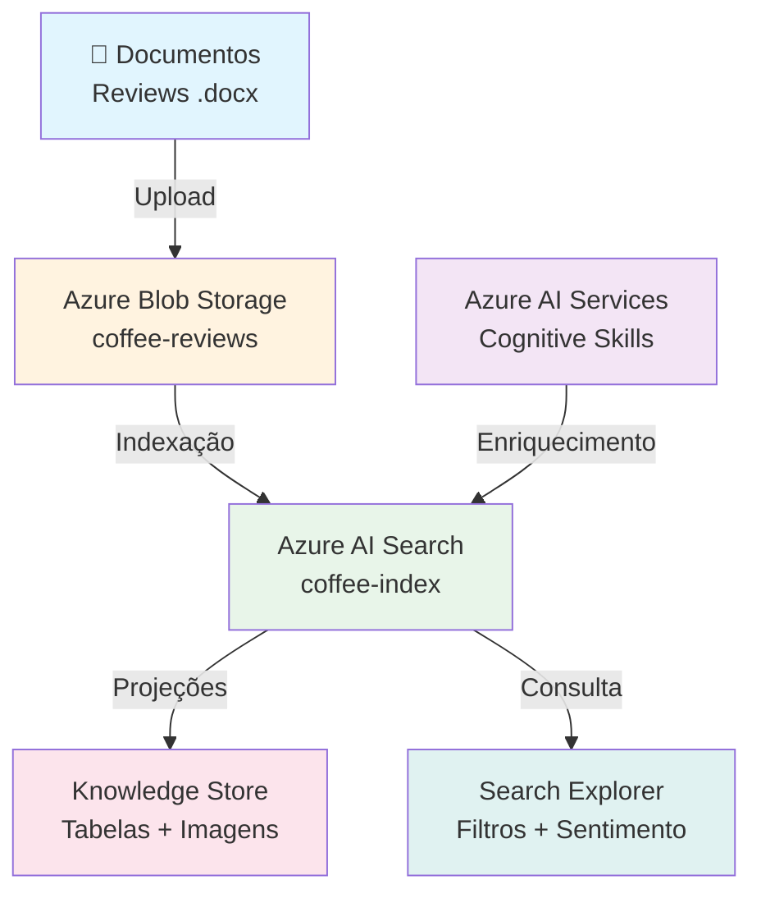
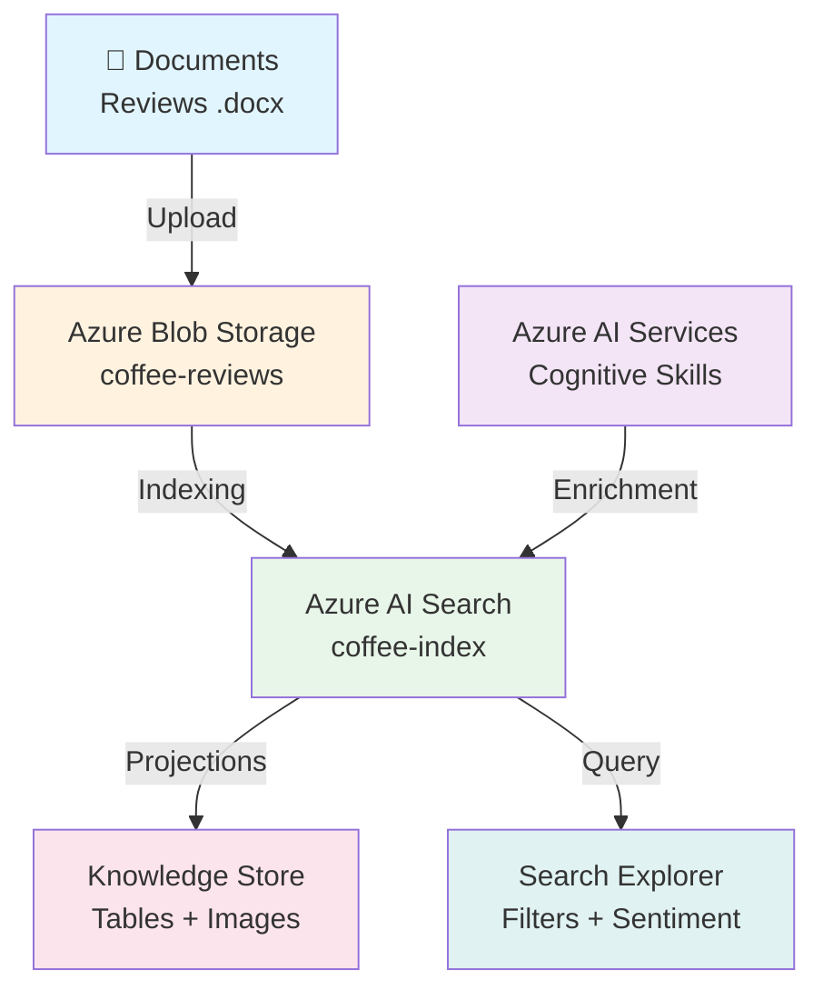

# ☁️ Azure Cognitive Search — AI Search para Indexação e Consulta de Dados

**[Português](#português) | [English](#english)**

*Projeto prático do bootcamp Microsoft Azure AI Fundamentals (DIO) — indexação cognitiva e consulta semântica de avaliações de clientes / Hands-on project from the Microsoft Azure AI Fundamentals bootcamp (DIO) — cognitive indexing and semantic querying of customer reviews*

---

## Português

### 📋 Sobre o Projeto

Laboratório prático que demonstra o uso do **Azure AI Search** para indexar e consultar dados enriquecidos com habilidades de IA. O cenário simula uma rede de cafeterias que precisa analisar avaliações de clientes para entender sentimentos, extrair frases-chave e gerar insights acionáveis.

### 🏗️ Arquitetura

### 🔧 Recursos Criados

| Recurso | Finalidade |
|---------|-----------|
| Azure AI Search | Gerenciamento de indexação e consulta |
| Azure AI Services | Habilidades cognitivas (sentimento, frases-chave, OCR) |
| Storage Account | Armazenamento de documentos brutos (Blob containers) |
| Knowledge Store | Dados enriquecidos persistidos (tabelas + projeções) |

### 📸 Etapas Documentadas

1. **Criação do Azure AI Search** — configuração do serviço de pesquisa
   

2. **Azure AI Services** — recurso LAB4-AI-900 para enriquecimento cognitivo
   

3. **Storage Account** — contêiner de blob para documentos
   

4. **Contêiner coffee-reviews** — importação e indexação dos dados
   

5. **Search Explorer** — filtragem por sentimento (negativo/positivo)
   

6. **Knowledge Store** — dados enriquecidos extraídos pelas habilidades de IA
   

7. **Projeções de imagem** — imagens armazenadas dos documentos
   

8. **Tabelas de entidades** — frases-chave capturadas pelo Knowledge Store
   

### 💡 Insights e Aplicabilidade

- **Análise de sentimento** permite identificar insatisfação de clientes em tempo real
- **Extração de frases-chave** automatiza a categorização de feedback
- **Filtros semânticos** possibilitam consultas refinadas por localização, produto e sentimento
- Aplicável em: varejo, hospitalidade, e-commerce, saúde, educação

### 📚 Referências

- [Azure AI Search Documentation](https://learn.microsoft.com/azure/search/)
- [Bootcamp DIO — Microsoft Azure AI Fundamentals](https://www.dio.me/)

---

## English

### 📋 About the Project

Hands-on lab demonstrating **Azure AI Search** for indexing and querying data enriched with AI skills. The scenario simulates a coffee shop chain that needs to analyze customer reviews to understand sentiment, extract key phrases, and generate actionable insights.

### 🏗️ Architecture

### 🔧 Resources Created

| Resource | Purpose |
|----------|---------|
| Azure AI Search | Indexing and query management |
| Azure AI Services | Cognitive skills (sentiment, key phrases, OCR) |
| Storage Account | Raw document storage (Blob containers) |
| Knowledge Store | Persisted enriched data (tables + projections) |

### 📸 Documented Steps

1. **Azure AI Search creation** — search service configuration
2. **Azure AI Services** — LAB4-AI-900 resource for cognitive enrichment
3. **Storage Account** — blob container for documents
4. **coffee-reviews container** — data import and indexing
5. **Search Explorer** — sentiment filtering (negative/positive)
6. **Knowledge Store** — AI-enriched data extraction
7. **Image projections** — stored document images
8. **Entity tables** — key phrases captured by Knowledge Store

### 💡 Insights and Applicability

- **Sentiment analysis** enables real-time customer dissatisfaction detection
- **Key phrase extraction** automates feedback categorization
- **Semantic filters** allow refined queries by location, product, and sentiment
- Applicable in: retail, hospitality, e-commerce, healthcare, education

### 📚 References

- [Azure AI Search Documentation](https://learn.microsoft.com/azure/search/)
- [DIO Bootcamp — Microsoft Azure AI Fundamentals](https://www.dio.me/)

---

## 👤 Autor / Author

**Gabriel Demetrios Lafis**

## 📄 Licença / License

Este projeto está licenciado sob a Licença MIT — veja o arquivo [LICENSE](LICENSE) para detalhes.

This project is licensed under the MIT License — see the [LICENSE](LICENSE) file for details.
